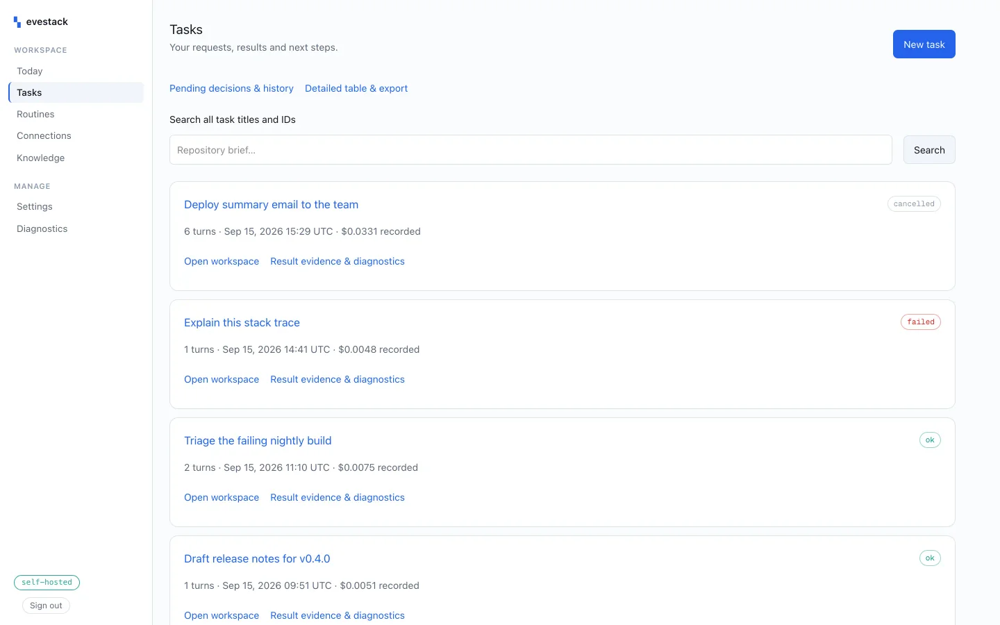

<div align="center">

# evestack

### Self-hosted eve, with a dashboard that drives your agents — not just watches them.

A self-hosted distribution of the eve agent framework — durable Postgres sessions, a Docker
sandbox, and a dashboard that **observes *and drives*** the agent. One command.

[](https://github.com/SammyTourani/evestack/actions/workflows/ci.yml)
[](https://www.npmjs.com/package/create-evestack)
[](./LICENSE)

**[See it before you run it →](https://evestack.vercel.app)**

</div>

<picture>
  <source media="(prefers-color-scheme: dark)" srcset=".github/dashboard-dark.webp">
  
</picture>

evestack is to `eve` what Ubuntu is to the Linux kernel. We don't fork eve. We package it so it
runs on your own hardware with one command, and we build the parts Vercel kept for itself.

```bash
npx create-evestack my-agent
cd my-agent
docker compose up -d postgres
npm run db:bootstrap     # create the workflow schema — nothing creates it for you
npm run dev
```

## Why this exists

[Vercel's eve](https://github.com/vercel/eve) is a genuinely good agent framework, it's
Apache-2.0, and Vercel documents self-hosting it — the adapters are there, on purpose. What
the docs don't ship is the rest of the machine. Off-platform, the guidance for observability
is to export OpenTelemetry to a collector you operate.

So you get Jaeger for spans and a terminal TUI for one session at a time. What no one ships
is a single place that speaks *sessions, turns, tokens, cost and approvals* — that more than
one person can open, that keeps history for as long as you keep the rows, and that can act on
the agent instead of only watching it.

evestack is that path, packaged end to end and certified against each eve release.

## Same framework, your infrastructure

| | Managed | Self-hosted with evestack |
| --- | --- | --- |
| Runs on | Vercel's infrastructure | your machine, VPS, or cluster |
| Session state | Vercel Workflows | your Postgres on `:5433` |
| Run history | retained by the platform | as long as you keep the rows |
| Dashboard | Agent Runs, hosted | included — observes *and drives* |
| Tool approvals | Vercel Passport | in the dashboard, with an audit trail |
| One-click tool sign-in | 4 managed connectors | 1,070 apps via Composio |
| Long-term memory | bring your own | included, on the same Postgres |
| Where your data sits | Vercel's platform | inside your network |

Off-platform the only thing that costs money is model tokens. Ollama takes even that to zero,
with a real caveat — see [Local models](#local-models).

## The dashboard

Everything Agent Runs shows you, plus the ability to act on it.

- **Sessions, turns, subagent trees** with duration, tokens, cached reads, and tool counts
- **Computed cost per turn.** eve only emits `gen_ai.usage.cost` for AI-Gateway calls, and a
  self-hosted agent calls its provider directly — so we price token counts ourselves. Models
  with no configured price are labelled `unpriced`, never silently counted as free.
- **Control**: start sessions, stream replies, resolve pending approvals, cancel runs
- **Integrations**: connect Gmail, GitHub, Slack, Notion and ~1,000 more in one browser flow

It reads eve's own tables. eve tags every run with framework-owned `$eve.*` attributes, and
`@workflow/world-postgres` persists them to `workflow.workflow_runs.attributes` as JSONB —
the very data behind Agent Runs, sitting in your database. So the core view is a SQL query
with no ingest pipeline to keep in sync. OpenTelemetry is the second tier, carrying only what
SQL can't: prompt bodies and tool arguments.

## Use one piece, not the whole thing

evestack ships as an [eve registry](https://eve.dev/docs), so an existing eve project can take
a single part without migrating anything:

```bash
eve registry add @evestack=https://raw.githubusercontent.com/SammyTourani/evestack/main/registry/r/{name}.json
eve add @evestack/memory
```

The registry is served straight off `main` on GitHub rather than a branded domain — evestack
owns no domain, and a URL nobody can resolve is worse than an ugly one. See
[docs/registry.mdx](docs/registry.mdx#where-the-registry-is-hosted) before changing it.

| Item | What it adds |
| --- | --- |
| `@evestack/memory` | Semantic long-term memory on your Postgres via pgvector |
| `@evestack/instrumentation` | Trace export to the evestack dashboard |
| `@evestack/docker-sandbox` | Local Docker sandbox instead of hosted Vercel Sandbox |
| `@evestack/basic-auth` | HTTP Basic route auth, for agents running off Vercel |

## Long-term memory, free

The Postgres running your sessions is already there, and the compose file uses the pgvector
image — so semantic recall costs one extension and no new container. The agent gets `remember`
and `recall` tools and keeps what matters across conversations.

Indexed with **HNSW, not IVFFlat**, and that is a correctness fix rather than a preference:
IVFFlat built on an empty table (as any bootstrap migration must be) probes one meaningless
centroid and returns nothing. We measured the same query returning 2 results at `LIMIT 3` and
**0** at `LIMIT 20`, purely because the query plan flipped. HNSW needs no training data and is
correct from the first row.

## Local models

`EVESTACK_PROVIDER=ollama` runs the whole stack on your own machine for literally nothing. Two
things are required to make it work at all, and both are set for you:

- **`modelContextWindowTokens` must be declared.** eve sizes compaction from the AI Gateway's
  model catalog, and a local model is not in it. Without an explicit value the agent refuses to
  compile: *"Cannot compile agent compaction because the primary compaction trigger model
  `ollama/qwen3` does not have known AI Gateway context window metadata."*
- **`OLLAMA_BASE_URL` takes the bare host, no `/api`.** `ai-sdk-ollama` appends the path itself;
  include it and every call returns `OllamaError: 404 page not found`.

**Check your RAM before you turn this on.** On an 8 GB Apple Silicon laptop already running
Docker, Postgres, the dashboard and the agent, loading qwen3 (5.2 GB) took **over three minutes
to answer "say ok"**, a 1.3 GB model timed out on the same prompt, and the machine eventually
became unusable and shut down. eve hands the model a large harness prompt and a dozen-plus
tools, so local inference here is not a light request.

Budget roughly **model size + 4 GB** free before starting, and prefer a machine with a
dedicated GPU. evestack never selects a local model on its own for this reason — you have to
set `EVESTACK_PROVIDER=ollama` explicitly. On a laptop already running the rest of this stack,
a hosted provider is the practical choice.

## Requirements

- Node 24+
- Docker (Postgres and the agent sandbox)
- A model API key — or [Ollama](https://ollama.com) for a genuinely $0 stack

## Repository layout

```
templates/default/             the agent: Postgres durability, Docker sandbox, memory
packages/dashboard/            Next.js observability + control plane
packages/create-evestack/      the one-command scaffolder            -> npm: create-evestack
packages/evestack-composio/    Composio wiring for one-click tool auth -> npm: @evestack/composio
packages/sandbox-opensandbox/  OpenSandbox sandbox backend            -> npm: @evestack/sandbox-opensandbox
packages/website/              the landing page
registry/                      the @evestack eve registry
```

The dashboard, the website and the agent template are not published to npm — the dashboard runs
from this repository, and the template ships *inside* `create-evestack`. Release order for the
three that are published is in [RELEASING.md](./RELEASING.md).

## Notes from building this

Things that cost real time, written down so they don't cost you any:

- **Pin `@workflow/world-postgres` to `@beta`.** npm `latest` is 4.3.3; eve 0.29.x needs the
  5.0.0-beta line and the runtime rejects mismatched protocol versions.
- **Your reverse proxy must forward both `/eve/` and `/.well-known/workflow/`**, unrewritten.
  Forward only `/eve/` and sessions start, then stall when callbacks can't get back.
- **`placeholderAuth()` and `vercelOidc()` are both wrong off Vercel.** eve fails closed, so
  swap in `httpBasic` or you'll 401 everything that isn't loopback.
- **In self-hosted production, loopback gets a 401 too — that is correct.** From eve 0.30,
  `localDev()` grants only inside an `eve dev` / `vercel dev` process, so a built server
  (`eve build && eve start`) grants nothing implicitly and every request, including
  `127.0.0.1`, needs the Basic credentials. Measured: all hosts 401, correct credentials 200.
  On 0.29.x this was the reverse *and exploitable* — `localDev()` matched an unanchored
  `/^127\./` against the attacker-controlled `Host` header, so `127.evil.com` obtained an
  unauthenticated principal. We found and patched that; Vercel fixed it upstream in 0.30.0.
  Pin eve `^0.30.2` or newer.
- **Adding `agent/instrumentation.ts` disables eve's zero-config trace spool**, so `eve traces`
  stops working. The dashboard supersedes it; delete the file to get it back.
- **Cancellation is cooperative.** `POST /eve/v1/session/:id/cancel` returns 202 immediately,
  but the in-flight model call keeps streaming — we measured ~90s — and `turn.cancelled`
  arrives *after* a `session.waiting`. Don't build a stop button that assumes silence.
- **Approvals have no dedicated endpoint.** They resolve through the ordinary follow-up route
  with `inputResponses: [{requestId, optionId}]`, the same protocol as `ask_question`.
- **Next.js 16 needs TypeScript 6**; TS 7 doesn't expose the compiler API it wants.
- **A failed turn still records `status = 'completed'`.** eve's event stream emits
  `turn.failed`, but the workflow row disagrees — the workflow handled the error, so nothing
  failed as far as it knows. Trusting `status` alone paints a green badge on a turn that
  produced nothing. `$eve.model` is only written once a model call reports usage, so its
  absence on a finished turn is the surviving evidence.
- **Watch your provider's daily request cap.** An OpenAI account with no payment method
  allows 50 requests per day; a day of building against it will exhaust that long before you
  expect, and the failure arrives as an opaque `MODEL_CALL_FAILED`.

## License

Apache-2.0, same as eve. eve is a trademark of Vercel; evestack is an independent project and
is not affiliated with or endorsed by Vercel.
